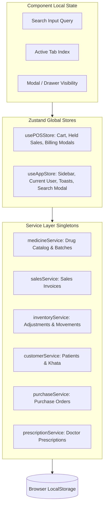

# .ai/skills/frontend.md — Frontend Architecture, React 19 & State Patterns

This skill details project-specific frontend conventions, state management rules, and TypeScript patterns for the Pharma POS application.

---

## 1. Technology Stack Conventions

- **React 19**: Functional components only; custom hooks for modular behavior.
- **TypeScript 5.8**: Strict type checking with `tsc --noEmit`. No `any` types.
- **Vite 6**: Fast ESM dev server and production bundler.
- **Tailwind CSS v4**: Utility-first CSS configured via `@import "tailwindcss";` in `src/index.css`.
- **Zustand v5**: Lightweight global state stores.
- **Lucide React**: The standard icon library (`import { Check, Search, Plus, Trash2 } from 'lucide-react'`).

---

## 2. State Distribution Architecture

---

## 3. UI Component Layering Guide

- **Base UI Primitives (`src/components/ui/`)**:
  - `Button.tsx`: Variants (`primary`, `secondary`, `outline`, `danger`, `ghost`), sizes (`sm`, `md`, `lg`), `isLoading` spinner.
  - `Badge.tsx`: Variants (`success`, `warning`, `danger`, `info`, `neutral`).
  - `Modal.tsx` & `Drawer.tsx`: Controlled overlays with `isOpen`, `onClose`, title, icon, and actions.
  - `Input.tsx` & `Select.tsx`: Standardized form controls with label, error message, and prefix/suffix icons.
  - `EmptyState.tsx`: Standard zero-data placeholder.
  - `Skeleton.tsx`: Content placeholder loader.
  - `Kbd.tsx`: Keyboard shortcut indicator badge.

- **Layout Components (`src/components/layout/`)**:
  - `AppLayout.tsx`: Root shell, keyboard event listener, route outlet.
  - `Sidebar.tsx`: Collapsible navigation with route badges.
  - `Topbar.tsx`: Search trigger, quick actions, employee session indicator.
  - `ToastContainer.tsx`: Fixed notification stack in bottom-right corner.

---

## 4. TypeScript Guidelines
- All shared interfaces live in `src/types/index.ts`.
- When adding or modifying a field in an interface, update all mock fixtures (`src/data/*`) and service transformers to prevent runtime `undefined` exceptions.
