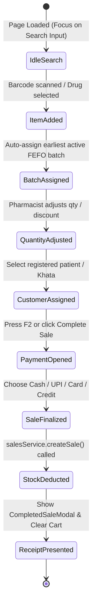

# .ai/skills/pos.md — Point of Sale (POS) Architecture & Billing Workflows

This skill guides any AI coding assistant on the implementation details, state management, and edge cases of the POS billing terminal.

---

## 1. POS Architecture Overview

The POS terminal is located at `/pos` (`src/pages/POSPage.tsx`) and is powered by:
- **Global Store**: `src/store/usePOSStore.ts` (`usePOSStore`)
- **Key Sub-components**:
  - `src/components/pos/BatchSelectorModal.tsx`: Explicit batch selection & stock inspection.
  - `src/components/pos/CustomerSelectModal.tsx`: Patient lookup with allergy and Khata balances.
  - `src/components/pos/PaymentModal.tsx`: Tender calculations, quick cash shortcuts, UPI QR, split payments.
  - `src/components/pos/CompletedSaleModal.tsx`: Post-sale thermal receipt rendering & print action.
  - `src/components/pos/HeldSalesDrawer.tsx`: Parked cart review and resumption.

---

## 2. Step-by-Step POS Checkout Lifecycle

---

## 3. Keyboard Shortcuts Invariant
The POS page implements high-speed keyboard shortcuts that **MUST NEVER BE BROKEN**:
- `F2`: Trigger Complete Sale / Open Payment Modal.
- `F4`: Park / Hold active cart to `heldSales`.
- `F8`: Open Held Sales Drawer to resume a parked sale.
- `Ctrl + K`: Global catalog & patient search.
- `Escape`: Dismiss any active modal or drawer.
- `Enter` (inside search): Automatically adds the top matching medicine to the cart.

---

## 4. Payment Modes & Split Tender Rules
1. **Cash**: Pharmacist enters `amountReceived`. System calculates `changeDue = max(0, amountReceived - grandTotal)`.
2. **UPI / QR**: Immediate full settlement recorded as digital transaction.
3. **Credit (Khata)**: Creates a completed sale with `paymentStatus = 'Pending'` and increases customer `outstandingBalance`.
4. **Split**: Pharmacist splits total across multiple methods (e.g. ₹500 Cash + ₹250 UPI). Sum of splits MUST equal `grandTotal`.

---

## 5. Critical Edge Cases to Safeguard
- **Zero Quantity Cart**: The "Complete Sale" button MUST be disabled if `cart.length === 0`.
- **Exceeding Available Batch Stock**: The quantity input for a line item MUST be clamped to `item.availableBatchStock`.
- **Expired Batches**: Under no circumstance may an expired batch be added or sold.
- **Doctor Registration Required**: When Schedule H medicines are in the cart and store settings require doctor info, prompt for doctor name before finalizing sale.
