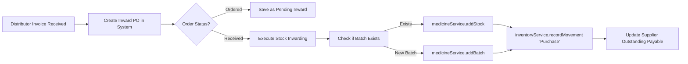

# .ai/skills/purchases.md — Inward Procurement & Supplier Purchase Inwarding

This skill guides AI assistants on managing inward purchase orders, supplier invoices, bonus schemes, and auto-batch creation.

---

## 1. Purchases Architecture

- **Page View**: `src/pages/PurchasesPage.tsx` (`/purchases`)
- **Service**: `src/services/purchaseService.ts` (`purchaseService`)
- **Related Types**: `PurchaseOrder`, `PurchaseItem`, `Supplier`, `Batch`

---

## 2. Inward Purchase Lifecycle

---

## 3. Bonus Quantity & Free Scheme Calculations

Pharmaceutical distributors frequently provide trade bonus schemes (e.g. "Buy 10, Get 2 Free"):
- **Invoiced Quantity**: `item.quantity` (Billable units).
- **Free Quantity**: `item.freeQuantity` (Bonus units).
- **Total Inwarded Units**:
  $$\text{Total Lot Intake} = \text{item.quantity} + (\text{item.freeQuantity} || 0)$$
- **Line Cost Calculation**:
  $$\text{Line Total} = (\text{item.quantity} \times \text{item.purchasePrice}) + \text{taxAmount} - \text{discount}$$
- The batch in inventory receives the full inwarded quantity (`Total Lot Intake`).

---

## 4. Automatic Batch Creation

When an inward order is marked as `'Received'`:
- If a batch with `batchNumber` already exists for that `medicineId`, its quantity is incremented.
- If it is a new lot, a new `Batch` object is initialized with:
  - `supplierId`, `supplierName`, `mfgDate`, `expiryDate`, `purchasePrice`, `mrp`, `sellingPrice = Math.round(mrp * 0.92)` (or calculated rate), `status = 'Active'`, `rackLocation`.
