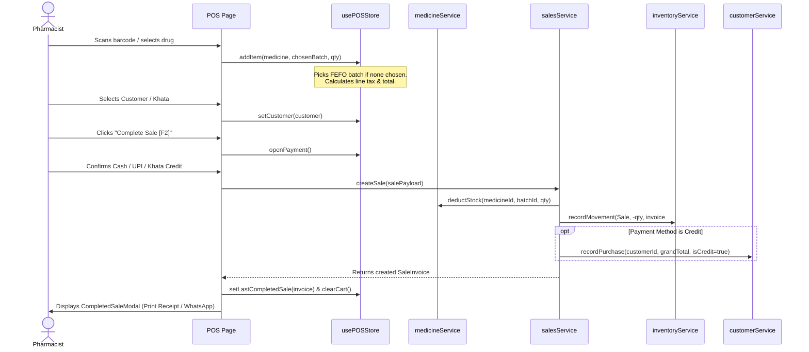

# ARCHITECTURE.md — System Architecture & Data Flow

This document details the concrete technical architecture, directory topology, data lifecycle, and state hierarchy of the **Pharma POS** application.

---

## 1. High-Level Architectural Diagram

```mermaid
flowchart TD
    subgraph Client [Browser Client (React 19 + Vite)]
        EP[Entry Point: main.tsx / App.tsx] --> RT[React Router DOM v7]
        RT --> LAY[AppLayout & Layout Chrome]
        
        subgraph LayoutLayer [Layout Components]
            LAY --> SB[Sidebar.tsx]
            LAY --> TB[Topbar.tsx]
            LAY --> GSM[GlobalSearchModal.tsx]
            LAY --> TC[ToastContainer.tsx]
        end

        subgraph PageLayer [Page Views (/src/pages/)]
            LAY --> PG_DASH[DashboardPage.tsx]
            LAY --> PG_POS[POSPage.tsx]
            LAY --> PG_SALES[SalesPage.tsx]
            LAY --> PG_INV[InventoryPage.tsx]
            LAY --> PG_MED[MedicinesPage.tsx]
            LAY --> PG_PUR[PurchasesPage.tsx]
            LAY --> PG_CUST[CustomersPage.tsx]
            LAY --> PG_SUP[SuppliersPage.tsx]
            LAY --> PG_RX[PrescriptionsPage.tsx]
            LAY --> PG_RET[ReturnsPage.tsx]
            LAY --> PG_EXP[ExpensesPage.tsx]
            LAY --> PG_REP[ReportsPage.tsx]
            LAY --> PG_EMP[EmployeesPage.tsx]
            LAY --> PG_SET[SettingsPage.tsx]
        end

        subgraph StateLayer [State Management (Zustand)]
            POS_STORE[usePOSStore.ts\nCart, Held Sales, Billing, Split Pay]
            APP_STORE[useAppStore.ts\nSidebar, Search, User, Toasts]
            LOCAL_STATE[React useState / useEffect\nSearch, Filters, Modals]
        end

        subgraph ServiceLayer [Domain Service Singletons (/src/services/)]
            MED_SVC[medicineService.ts]
            SALES_SVC[salesService.ts]
            INV_SVC[inventoryService.ts]
            PUR_SVC[purchaseService.ts]
            CUST_SVC[customerService.ts]
            SUP_SVC[supplierService.ts]
            RX_SVC[prescriptionService.ts]
            RET_SVC[returnService.ts]
            EXP_SVC[expenseService.ts]
            SET_SVC[settingsService.ts]
            EMP_SVC[employeeService.ts]
        end

        subgraph StorageLayer [Persistence & Data Fixtures]
            LS[(Browser LocalStorage Keys)]
            FIXTURES[(Initial Data Fixtures /src/data/*)]
        end
    end

    PG_POS <--> POS_STORE
    PageLayer <--> APP_STORE
    PageLayer <--> LOCAL_STATE
    
    POS_STORE --> SALES_SVC
    POS_STORE --> MED_SVC
    POS_STORE --> CUST_SVC

    PageLayer <--> ServiceLayer
    ServiceLayer <--> LS
    ServiceLayer -.->|Initial Seed| FIXTURES
```

---

## 2. Directory Structure & File Map

```
/
├── AI_CONTEXT.md                # Primary AI overview & quick start
├── AGENTS.md                    # Rules & guidelines for AI assistants
├── ARCHITECTURE.md              # Architectural & structural source of truth
├── BUSINESS_RULES.md            # Verified business logic & pharmacy rules
├── DATA_MODEL.md                # TypeScript entities & schema descriptions
├── UX_GUIDELINES.md             # Visual design & interaction rules (Light Mode)
├── PROJECT_STATUS.md            # Verified implementation status & gaps
├── README.md                    # Developer installation & run instructions
│
├── .ai/                         # Universal AI Skills & Workflow Knowledge Base
│   ├── README.md                # AI entry point
│   ├── SKILLS_INDEX.md          # Index of all domain and technical skills
│   ├── skills/                  # Dedicated skill documentation
│   └── workflows/               # Structured step-by-step playbooks
│
├── src/
│   ├── main.tsx                 # React DOM root mounting
│   ├── App.tsx                  # BrowserRouter routing definitions
│   ├── index.css                # Tailwind CSS v4 entry (@import "tailwindcss";)
│   │
│   ├── components/
│   │   ├── layout/              # Layout frame, sidebars, headers, global modals
│   │   │   ├── AppLayout.tsx
│   │   │   ├── Sidebar.tsx
│   │   │   ├── Topbar.tsx
│   │   │   ├── GlobalSearchModal.tsx
│   │   │   ├── QuickActionModal.tsx
│   │   │   ├── KeyboardShortcutsModal.tsx
│   │   │   └── ToastContainer.tsx
│   │   │
│   │   ├── pos/                 # Point-of-Sale terminal sub-components
│   │   │   ├── BatchSelectorModal.tsx
│   │   │   ├── CustomerSelectModal.tsx
│   │   │   ├── PaymentModal.tsx
│   │   │   ├── CompletedSaleModal.tsx
│   │   │   └── HeldSalesDrawer.tsx
│   │   │
│   │   └── ui/                  # Reusable design system UI primitives
│   │       ├── Badge.tsx
│   │       ├── Button.tsx
│   │       ├── Card.tsx
│   │       ├── Drawer.tsx
│   │       ├── EmptyState.tsx
│   │       ├── Input.tsx
│   │       ├── Kbd.tsx
│   │       ├── Modal.tsx
│   │       ├── Select.tsx
│   │       ├── Skeleton.tsx
│   │       └── Tabs.tsx
│   │
│   ├── data/                    # Initial seed fixtures
│   │   ├── medicines.ts
│   │   ├── sales.ts
│   │   ├── purchases.ts
│   │   ├── customers.ts
│   │   ├── suppliers.ts
│   │   ├── prescriptions.ts
│   │   ├── returns.ts
│   │   ├── expenses.ts
│   │   ├── employees.ts
│   │   ├── stockMovements.ts
│   │   └── settings.ts
│   │
│   ├── pages/                   # Page view components
│   │   ├── DashboardPage.tsx
│   │   ├── POSPage.tsx
│   │   ├── SalesPage.tsx
│   │   ├── InventoryPage.tsx
│   │   ├── MedicinesPage.tsx
│   │   ├── PurchasesPage.tsx
│   │   ├── CustomersPage.tsx
│   │   ├── SuppliersPage.tsx
│   │   ├── PrescriptionsPage.tsx
│   │   ├── ReturnsPage.tsx
│   │   ├── ExpensesPage.tsx
│   │   ├── ReportsPage.tsx
│   │   ├── EmployeesPage.tsx
│   │   └── SettingsPage.tsx
│   │
│   ├── services/                # Business logic & persistence services
│   │   ├── medicineService.ts
│   │   ├── salesService.ts
│   │   ├── inventoryService.ts
│   │   ├── purchaseService.ts
│   │   ├── customerService.ts
│   │   ├── supplierService.ts
│   │   ├── prescriptionService.ts
│   │   ├── returnService.ts
│   │   ├── expenseService.ts
│   │   ├── settingsService.ts
│   │   └── employeeService.ts
│   │
│   ├── store/                   # Zustand global stores
│   │   ├── usePOSStore.ts
│   │   └── useAppStore.ts
│   │
│   ├── types/                   # Unified TypeScript definitions
│   │   └── index.ts
│   │
│   └── utils/                   # Shared formatting & date calculations
│       └── formatters.ts
```

---

## 3. Data Flow and Responsibility Patterns

### POS Checkout Flow


---

## 4. State Management Classification

| State Type | Mechanism | Examples | Lifecycle |
|---|---|---|---|
| **Global UI State** | `useAppStore` (Zustand) | Sidebar collapsed, Global search modal open, Active user session, Toast messages | Session (in-memory) |
| **Active Billing State** | `usePOSStore` (Zustand) | Cart items, customer, discount %, held carts | Synced to `localStorage` for held carts; cart clears on sale completion |
| **Domain Data** | `src/services/*` (Class Singletons) | Drug inventory, Batches, Sales history, Customer ledger, Inward POs | Persisted in `localStorage` |
| **Page-Level View State** | React `useState` | Search query, active tab index, filter dropdowns, drawer visibility | Unmounted on route change |

---

## 5. LocalStorage Keys Reference
- `pharmapos_medicines_v1`
- `pharmapos_sales_v1`
- `pharmapos_purchases_v1`
- `pharmapos_customers_v1`
- `pharmapos_suppliers_v1`
- `pharmapos_prescriptions_v1`
- `pharmapos_sales_returns_v1`
- `pharmapos_purchase_returns_v1`
- `pharmapos_movements_v1`
- `pharmapos_adjustments_v1`
- `pharmapos_expenses_v1`
- `pharmapos_employees_v1`
- `pharmapos_settings_v1`
- `pharmapos_held_sales_v1`
